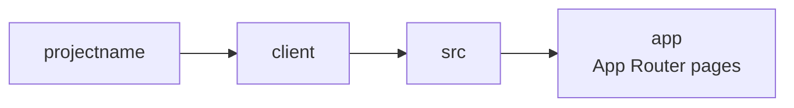
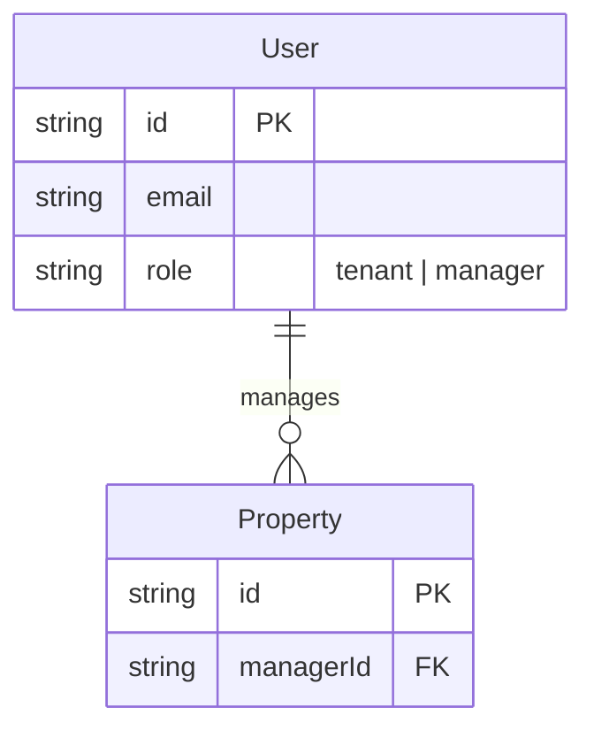

# createreadme.md

A replicable standard for building production-grade GitHub READMEs in this style.
Read the actual source code before writing anything — never rely on assumptions.

---

## Step 0: Read the project first

Before writing a single line, read:
- Entry point / server index (routes, middleware, auth)
- All route files
- All controller files
- Prisma schema (or equivalent data model)
- `package.json` for scripts and dependencies

This gives you accurate architecture decisions, real request/response shapes, actual env vars, and the true data model — not guesses.

---

## README Structure (in order)

1. Header (centered)
2. Overview
3. Architecture
4. Tech Stack
5. Project Structure
6. Data Model
7. Getting Started
8. API Reference
9. Scripts
10. Footer

---

## 1. Header

```markdown
<div align="center">

# Project Name

**One-line tagline: what it does and what makes it notable.**

[] [] ...

</div>
```

**Badge format** — always flat-square, dark background, GitHub blue logo:
```
https://img.shields.io/badge/LABEL-0d1117?style=flat-square&logo=LOGO&logoColor=58a6ff
```

Top-level badges in the header = primary technologies only (5–9 max).

---

## 2. Overview

2–3 sentences. What the app does and who uses it. Then one sentence on what makes the architecture notable. No bullet lists here.

---

## 3. Architecture

Bold heading per decision, paragraph explanation below it. Each entry answers:
- What was chosen
- What was rejected and why
- What the implication is

Example pattern:
```markdown
**Custom JWT auth, not a managed identity provider**
Auth is built on `bcryptjs` + `jsonwebtoken`...
```

Only document decisions that are non-obvious or that involved a real tradeoff.

---

## 4. Tech Stack

Use an HTML table split into two columns. Categories:

| Category | When to include |
|---|---|
| Frontend | Always if there's a UI |
| Backend | Always if there's a server |
| Database | Always |
| Security | When auth/encryption tools are explicit dependencies |
| Payment | When a payment gateway is integrated |
| AI/ML | When ML models or AI APIs are used |
| CloudOps | When deployment/infra tools are explicit (Docker, Vercel, AWS) |

Remove any category that doesn't apply. Never leave an empty section.

```html
<table>
<tr>
<td valign="top" width="50%">

**Frontend**


**Backend**


</td>
<td valign="top" width="50%">

**Database**


**Security**


</td>
</tr>
</table>
```

Rules:
- ORM goes in Database, not Backend
- Auth libraries (JWT, bcrypt) go in Security
- File upload (Multer) goes in Backend
- All badges: `style=flat-square`, bg `0d1117`, logoColor `58a6ff`

---

## 5. Project Structure

Use a Mermaid `graph LR` flowchart. **Never use ASCII tree art.**



Rules:
- **Never lump paths**: `client/src` is wrong. Use `client` → `src` as two separate nodes.
- **No trailing slashes** on node labels. Mermaid renders them as boxes — the slash is redundant.
- **No HTML tags** inside node labels (`<font color>` etc.) — breaks the GitHub mobile app.
- Node label format: `"foldername\ndescription"` for nodes with descriptions, `"foldername"` for structural nodes.
- Each directory level = its own node.
- Use unique node IDs when the same folder name appears in multiple branches (e.g. `csrc` and `ssrc` for two `src` folders).

---

## 6. Data Model

Use Mermaid ERD. Read the actual schema file — never guess field names or types.

**For small schemas (≤10 models):** single ERD diagram.

**For large schemas (>10 models):** split into domain groups, one ERD per group. Common groups:
- Chat / Conversations
- Client Portal
- CMS + Agency Ops
- Configuration



Rules:
- Relationship labels go in quotes: `"manages"`, `"submits"`, `"billed via"`
- Use `nullable: true` in field comments where relevant: `string leaseId FK "null until Approved"`
- Enum values go in the field comment string

---

## 7. Getting Started

Sections: Prerequisites → Clone → Environment → Database → Run

Show actual env var names from the source. Show separate blocks for each env file if there are multiple.

---

## 8. API Reference (Swagger on GitHub Pages)

### Step 1: Read all routes and controllers

Go through every route file and controller. Document:
- HTTP method and path
- Auth requirement (which roles)
- Request body fields (required vs optional, from actual validation code)
- Query parameters (from `req.query` destructuring)
- Response shape (from `res.json(...)` calls)
- Error responses (from status codes in controllers)

### Step 2: Create `docs/openapi.yaml`

Full OpenAPI 3.0.3 spec. Structure:

```yaml
openapi: 3.0.3
info:
  title: Project API
  description: |
    Description with auth instructions.
  version: 1.0.0
servers:
  - url: http://localhost:PORT
tags: [...]
components:
  securitySchemes:
    bearerAuth:
      type: http
      scheme: bearer
      bearerFormat: JWT
  schemas:
    Error:
      type: object
      properties:
        message:
          type: string
paths:
  /route:
    get:
      tags: [TagName]
      summary: Short description
      security:
        - bearerAuth: []
      responses:
        '200':
          description: Success
```

Key rules:
- GET and POST on the same path go under the same path key (no duplicate keys in YAML)
- `multipart/form-data` for file upload endpoints
- Always include 401, 403, 404, 409 responses where the controller returns them
- `nullable: true` for fields that can be null

### Step 3: Create `docs/index.html`

```html
<!DOCTYPE html>
<html lang="en">
  <head>
    <meta charset="UTF-8" />
    <title>Project API Docs</title>
    <link rel="stylesheet" href="https://unpkg.com/swagger-ui-dist@5/swagger-ui.css" />
    <link rel="stylesheet" href="https://cdn.jsdelivr.net/gh/Amoenus/SwaggerDark@master/SwaggerDark.css" />
    <style>
      body { margin: 0; }
      .topbar { display: none; }
    </style>
  </head>
  <body>
    <div id="swagger-ui"></div>
    <script src="https://unpkg.com/swagger-ui-dist@5/swagger-ui-bundle.js"></script>
    <script>
      SwaggerUIBundle({
        url: './openapi.yaml',
        dom_id: '#swagger-ui',
        presets: [SwaggerUIBundle.presets.apis, SwaggerUIBundle.SwaggerUIStandalonePreset],
        layout: 'BaseLayout',
        deepLinking: true,
        displayRequestDuration: true,
        filter: true,
      })
    </script>
  </body>
</html>
```

Dark theme is provided by `SwaggerDark.css` from `Amoenus/SwaggerDark` via jsDelivr. The `.topbar { display: none }` removes the Swagger branding bar.

### Step 4: Enable GitHub Pages via CLI

```bash
gh api repos/OWNER/REPO/pages \
  --method POST \
  -f source[branch]=main \
  -f source[path]=/docs
```

Change `main` to `master` if that's the default branch.

### Step 5: Add badge button to README

```html
<div align="center">
  <a href="https://OWNER.github.io/REPO" target="_blank">
    
  </a>
</div>
```

---

## 9. Scripts

Simple bash code block with comments. Group by Server / Client / Database if the project is split.

---

## 10. Footer

Centered div. Order (top to bottom):
1. Author name as a GitHub profile link
2. LinkedIn + Email badge row
3. CiroStack SVG wordmark as a linked image

```html
<div align="center">

[Your Name](https://github.com/handle)

[](https://linkedin.com/in/handle)
[](mailto:you@email.com)

<a href="https://cirostack.com"></a>

</div>
```

### CiroStack wordmark SVG

Commit `assets/cirostack-wordmark.svg` to the repo. Use `<tspan>` for zero-gap between Ciro and Stack — separate `<text>` elements with hardcoded x positions will drift:

```svg
<svg xmlns="http://www.w3.org/2000/svg" width="95" height="26" viewBox="0 0 95 26">
  <text x="0" y="20" font-family="-apple-system, BlinkMacSystemFont, 'Segoe UI', Arial, sans-serif" font-size="18" font-weight="700">
    <tspan fill="#ffffff">Ciro</tspan><tspan fill="#e03c31">Stack</tspan>
  </text>
</svg>
```

**Why SVG and not HTML color tags:** GitHub's markdown sanitizer strips `style` attributes and `color` attributes from `<font>` and `<span>` tags. SVG image files committed to the repo are the only reliable way to render colored text in a GitHub README.

---

## Color reference

| Use | Value |
|---|---|
| Badge background | `#0d1117` |
| Badge logo / text | `58a6ff` (GitHub blue) |
| CiroStack "Ciro" | `#ffffff` |
| CiroStack "Stack" | `#e03c31` |
| LinkedIn badge | `0A66C2` |
| Email badge | `EA4335` |
| Swagger badge logo | `85EA2D` |

---

## Known limitations

| Issue | Cause | Fix |
|---|---|---|
| Mermaid breaks on GitHub mobile app | HTML tags (`<font>`) inside node labels | Never use HTML in Mermaid labels |
| Colored text doesn't render | GitHub strips `style`/`color` attributes | Use SVG image files for colored text |
| Two `<text>` elements in SVG have a gap | Hardcoded x positions don't account for font metrics | Use `<tspan>` inside a single `<text>` element |
| AVIF logo shows only icon, not wordmark | Logo file is icon-only (no text baked in) | Create a separate SVG wordmark |
| GitHub Pages shows 404 on first deploy | Build takes 1–2 minutes after enabling | Wait and refresh |
